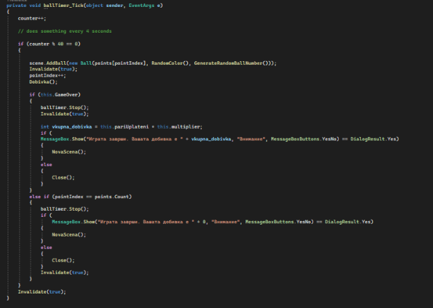

#Lucky Balls-6 Project by: Filip Trajanovikj, Stefan Trajanov, Gligorco Trajkov

1\. Опис на Апликацијата:

Станува збор за игра која се применува во обложувалниците наречена Lucky 6, која нас ни овозможува два вида на кладење:

- Парност( првите 6 топчиња да бидат парни/непарни )

- Комбинација од 6 рандом топчиња во ранг од 1 до 46.

Доколку играчот ја погоди парноста добивката е x1000 од уплатата, а доколку ја погоди добитната комбинација од 6 топчиња во зависност од позицијата на последното погодено топче се добива multiplierot.

2\. Упатство за користење:

-Кога ке ја уклучиме апликацијата ни се појавуваат местат каде што ке се поставуваат топчињата заедно со multiplierite. Притоа играчот не може да кликне старт доколку нема уплатено ливче.

\- Кога играчот ке кликне уплата се појавува нова форма каде што може да избере кој вид на кладење ке го игра (горенаведените). Истовремено двата не може, се зима едното само.

\- Од како играчот ке кликне ОК, се прикажува типот на кладење што е избран соодветно со комбинацијата или парноста

\- По завршување на играта се појавува MessageBox, за тоа која е добивката на играчот и дали сака да започне нова игра.

3\. Опис на проблемот/решението

Имаме класа BallPlacement каде што се користи за прикажување на местата каде треба да се појават топчињата при нивно извлекување соодветно.
Класа Ball-каде што е соодветна класа за топчето кое што се влече, содржи бројка(рандом) и боја(рандом)

Класа Uplata – која ја претставува самата уплата и типот на кладење

3.1 Алгоритми

Имаме повеке алгоритми односно методи се со цел апликацијата да работи како што треба.

За генерирање на самото топче со соодветен број. Се одбира рандом број од 1 до 47, се проверува доколку го содржи тој број се бира нов, кога ке најде број кој што не го содржи го става во листата на генерирани, каде во следниот ги поставува.

За поставување на топчињата на соодветните места. Се генерираат со точно определни пиксели места каде треба да се постават топчињата. Таа позиција е фиксна и никогаш не се менува.

Метод кој што се повикува на секој тик на тајмерот, и проверува дали играта завршила, истовремено додава ново топче и ја повикува Dobivka(), која ке ја објасниме подоле. Исто така ја пресметува крајната добивка.

Алгоритам за пресметување на добивката односно дали ливчето е добитно, во случај да не се кладел на парност самиот играч, ке ја пресмета добивката за добитна 6цифрена комбинација. Инаку ја повикуваме DobivkaZaParnost()

Доколку нема топчиња ке прекине, инаку започнува од првите 6, ги зима и ги проверува доколку паднат и двата флага истовремено невозможно е да има добивка, а доколку барем еден остане од нив кренат имаме добивка. Тргнуваме со претпоставка дека сите се парни/непарни.
